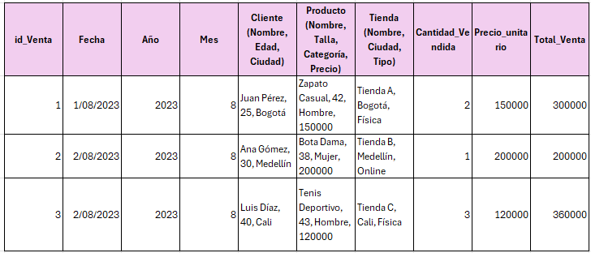
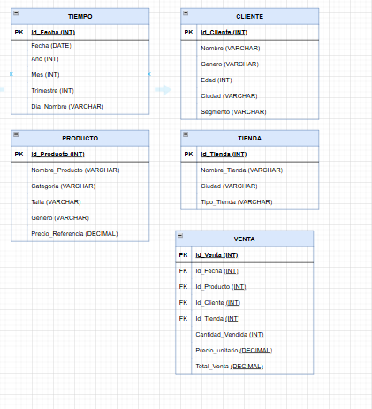
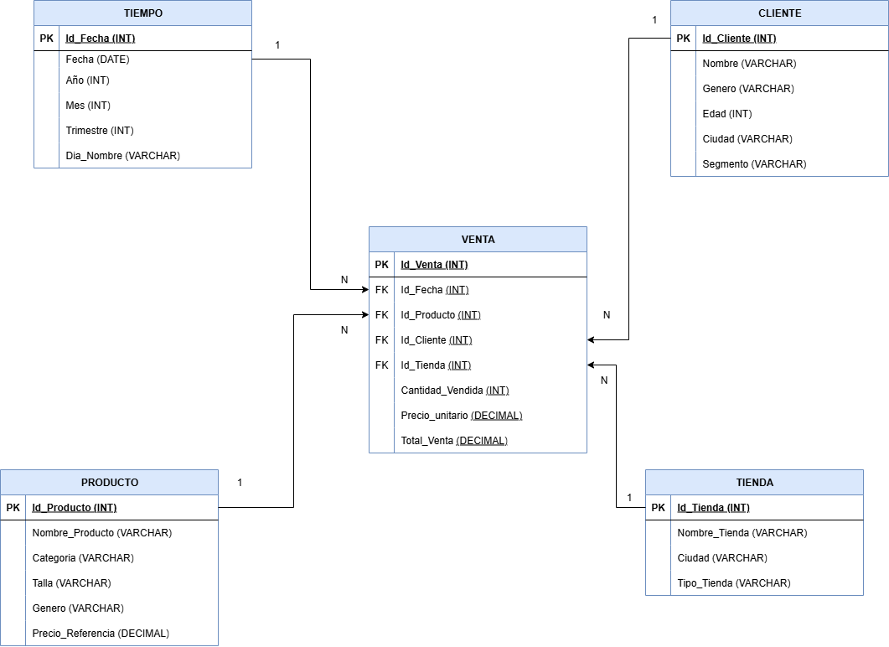

<html lang="es">
<head>
    <meta charset="UTF-8">
    <meta name="viewport" content="width=device-width, initial-scale=1.0">
    <title>Tutorial Interactivo de Normalización de Base de Datos</title>
    <link rel="stylesheet" href="https://stackpath.bootstrapcdn.com/bootstrap/4.5.2/css/bootstrap.min.css">
    
</head>
<body>
    

        <h1 class="text-center mb-4">Tutorial Interactivo de Normalización de Base de Datos</h1>
        
¡Bienvenido! Esta página es una guía amigable y detallada sobre la normalización de bases de datos, un concepto clave en el mundo de la informática que ayuda a organizar la información de manera eficiente. Imagina que una base de datos es como un armario desordenado: la normalización es el proceso de ordenarlo para que todo esté en su lugar, sin repeticiones innecesarias y fácil de usar. Exploraremos paso a paso la Primera Forma Normal (1FN), Segunda Forma Normal (2FN) y Tercera Forma Normal (3FN). Usaremos ejemplos simples de una base de datos de ventas en una tienda de zapatos para que sea fácil de entender, incluso si eres nuevo en esto. Haz clic en los botones para expandir secciones y descubrir más detalles interactivos. ¡Vamos a empezar!

        

            <!-- Sección 1FN -->
            

                

                    <h2 class="mb-0">
                        <button class="btn btn-link btn-block text-left" type="button" data-toggle="collapse" data-target="#collapseOne" aria-expanded="true" aria-controls="collapseOne">
                            Primera Forma Normal (1FN): El Primer Paso para Organizar
                        </button>
                    </h2>
                

                

                    

                        
Imagina que tienes una lista de compras en una hoja de papel donde todo está escrito en una sola columna larga: nombres de clientes, fechas, productos, precios... todo mezclado. Esto es como una base de datos sin normalizar. La Primera Forma Normal (1FN) es como dividir esa lista en columnas separadas en una tabla, asegurándonos de que cada celda contenga solo un valor simple y único, sin listas o grupos repetidos dentro de una misma celda. Por ejemplo, en lugar de poner "Juan Pérez, 25 años, Bogotá" en una sola celda, lo dividimos en columnas separadas para nombre, edad y ciudad. Esto hace que la información sea "atómica", es decir, indivisible, como átomos en la química.

                        
En nuestra base de datos de ventas de zapatos, empezamos con una tabla grande que incluye todo: detalles de la venta, el cliente, el producto, la tienda y la fecha. Aunque esto parece simple al principio, causa problemas como repetir la misma información muchas veces (por ejemplo, si un cliente compra varios zapatos, su nombre y edad se escriben una y otra vez). Esto no solo ocupa más espacio, sino que puede llevar a errores: ¿qué pasa si actualizas la edad de un cliente en una fila pero olvidas las demás? ¡Inconsistencias por todos lados!

                        <h4>¿Qué se realizó exactamente en la 1FN?</h4>
                        
El objetivo principal fue eliminar cualquier valor multivaluado. Si una celda tenía varios datos separados por comas (como "zapatos, botas, tenis"), lo convertimos en filas separadas o columnas individuales. En este caso, la tabla ya estaba cerca de la 1FN, pero aseguramos que cada columna represente un solo atributo. Sin embargo, todavía hay redundancias porque la información no está separada en temas lógicos. Esto resuelve problemas básicos de almacenamiento, pero deja anomalías: no puedes agregar un cliente nuevo sin una venta, y eliminar una venta podría borrar datos importantes del cliente.

                        

                            
                        

                        
En la imagen arriba, ves cómo se ve la estructura inicial. Es como una tabla de Excel gigante, pero lista para mejorar.

                        <button class="btn btn-primary" data-toggle="collapse" data-target="#details1FN">Explorar Detalles Interactivos y Más Explicaciones</button>
                        

                            <ul>
                                <li><strong>Por qué es importante:</strong> Sin 1FN, buscar información es caótico, como buscar una aguja en un pajar. Con ella, puedes filtrar fácilmente, por ejemplo, todas las ventas de agosto.</li>
                                <li><strong>Anomalía de Inserción (explicada simple):</strong> Imagina querer agregar un nuevo cliente que aún no ha comprado nada. En esta estructura, no puedes, porque cada fila necesita una venta completa. ¡Es como no poder agregar un contacto a tu teléfono sin hacer una llamada primero!</li>
                                <li><strong>Anomalía de Actualización:</strong> Si un cliente cambia de ciudad, tienes que buscar y cambiarlo en todas las filas donde aparece. Si olvidas una, tendrás datos inconsistentes, como el mismo cliente viviendo en dos ciudades diferentes.</li>
                                <li><strong>Anomalía de Eliminación:</strong> Si borras una venta vieja, podrías perder toda la info del cliente si era su única compra. Es como tirar un álbum de fotos y perder recuerdos únicos.</li>
                                <li><strong>Consejo para principiantes:</strong> Piensa en 1FN como el "modo básico" de una base de datos: asegura que todo esté en celdas individuales, preparando el terreno para pasos más avanzados.</li>
                            </ul>
                        

                    

                

            

            <!-- Sección 2FN -->
            

                

                    <h2 class="mb-0">
                        <button class="btn btn-link btn-block text-left collapsed" type="button" data-toggle="collapse" data-target="#collapseTwo" aria-expanded="false" aria-controls="collapseTwo">
                            Segunda Forma Normal (2FN): Eliminando Repeticiones Parciales
                        </button>
                    </h2>
                

                

                    

                        
Ahora que tenemos nuestra tabla organizada en columnas simples (gracias a la 1FN), notamos que hay repeticiones. Por ejemplo, si el mismo zapato se vende muchas veces, su precio y descripción se repiten en cada fila. La Segunda Forma Normal (2FN) resuelve esto separando la información en tablas más pequeñas y especializadas. Cada tabla se enfoca en un tema: una para clientes, otra para productos, otra para fechas, etc. Usamos "claves" (como números ID únicos) para conectarlas, como hilos que unen piezas de un rompecabezas.

                        
En términos simples, 2FN asegura que cada pieza de información dependa completamente de la "clave principal" de su tabla. Si algo depende solo de parte de la clave (en tablas con claves compuestas), lo movemos a una nueva tabla. En nuestra tienda de zapatos, creamos tablas separadas para "Tiempo" (fechas), "Cliente", "Producto", "Tienda" y "Venta" (que une todo). Así, el nombre de un cliente se guarda solo una vez, y en la tabla de ventas solo ponemos su ID. Esto reduce el espacio y evita errores al actualizar datos.

                        <h4>¿Qué se realizó exactamente en la 2FN?</h4>
                        
Identificamos "dependencias parciales": por ejemplo, la edad de un cliente depende solo del cliente, no de la venta específica. Así que movimos esos detalles a su propia tabla. Ahora, si un producto cambia de precio, lo actualizas en un solo lugar. Esto hace la base más eficiente, como organizar tus fotos en álbumes temáticos en lugar de mezclar todo en una caja grande. Sin embargo, aún hay dependencias "transitivas" (como un campo que depende de otro campo no clave), que resolveremos en la siguiente forma.

                        
<strong>Estructura en 2FN (Esquema con Tablas Separadas):</strong> Aquí mostramos los campos de cada tabla para que veas cómo se divide la info.

                        
<strong>Tabla TIEMPO:</strong>

                        <table class="table table-bordered table-striped">
                            <thead><tr><th>Campo</th><th>Tipo</th></tr></thead>
                            <tbody>
                                <tr><td>Id_Fecha</td><td>INT (PK)</td></tr>
                                <tr><td>Fecha</td><td>DATE</td></tr>
                                <tr><td>Año</td><td>INT</td></tr>
                                <tr><td>Mes</td><td>INT</td></tr>
                                <tr><td>Trimestre</td><td>INT</td></tr>
                                <tr><td>Dia_Nombre</td><td>VARCHAR</td></tr>
                            </tbody>
                        </table>
                        
<strong>Tabla CLIENTE:</strong>

                        <table class="table table-bordered table-striped">
                            <thead><tr><th>Campo</th><th>Tipo</th></tr></thead>
                            <tbody>
                                <tr><td>Id_Cliente</td><td>INT (PK)</td></tr>
                                <tr><td>Nombre</td><td>VARCHAR</td></tr>
                                <tr><td>Genero</td><td>VARCHAR</td></tr>
                                <tr><td>Edad</td><td>INT</td></tr>
                                <tr><td>Ciudad</td><td>VARCHAR</td></tr>
                                <tr><td>Segmento</td><td>VARCHAR</td></tr>
                            </tbody>
                        </table>
                        
<strong>Tabla PRODUCTO:</strong>

                        <table class="table table-bordered table-striped">
                            <thead><tr><th>Campo</th><th>Tipo</th></tr></thead>
                            <tbody>
                                <tr><td>Id_Producto</td><td>INT (PK)</td></tr>
                                <tr><td>Nombre_Producto</td><td>VARCHAR</td></tr>
                                <tr><td>Categoria</td><td>VARCHAR</td></tr>
                                <tr><td>Talla</td><td>VARCHAR</td></tr>
                                <tr><td>Genero</td><td>VARCHAR</td></tr>
                                <tr><td>Precio_Referencia</td><td>DECIMAL</td></tr>
                            </tbody>
                        </table>
                        
<strong>Tabla TIENDA:</strong>

                        <table class="table table-bordered table-striped">
                            <thead><tr><th>Campo</th><th>Tipo</th></tr></thead>
                            <tbody>
                                <tr><td>Id_Tienda</td><td>INT (PK)</td></tr>
                                <tr><td>Nombre_Tienda</td><td>VARCHAR</td></tr>
                                <tr><td>Ciudad</td><td>VARCHAR</td></tr>
                                <tr><td>Tipo_Tienda</td><td>VARCHAR</td></tr>
                            </tbody>
                        </table>
                        
<strong>Tabla VENTA:</strong>

                        <table class="table table-bordered table-striped">
                            <thead><tr><th>Campo</th><th>Tipo</th></tr></thead>
                            <tbody>
                                <tr><td>Id_Venta</td><td>INT (PK)</td></tr>
                                <tr><td>Id_Fecha</td><td>INT (FK)</td></tr>
                                <tr><td>Id_Producto</td><td>INT (FK)</td></tr>
                                <tr><td>Id_Cliente</td><td>INT (FK)</td></tr>
                                <tr><td>Id_Tienda</td><td>INT (FK)</td></tr>
                                <tr><td>Cantidad_Vendida</td><td>INT</td></tr>
                                <tr><td>Precio_unitario</td><td>DECIMAL</td></tr>
                                <tr><td>Total_Venta</td><td>DECIMAL</td></tr>
                            </tbody>
                        </table>
                        

                            
                        

                        
La imagen muestra cómo las tablas se conectan con flechas, representando relaciones.

                        <button class="btn btn-primary" data-toggle="collapse" data-target="#details2FN">Explorar Detalles Interactivos y Más Explicaciones</button>
                        

                            <ul>
                                <li><strong>Dependencias Parciales Eliminadas (explicado simple):</strong> Si una tabla tiene una clave con dos partes (ej: ID de venta + ID de producto), y algo como el precio depende solo del producto, lo movemos a la tabla de productos. Así, todo en una tabla depende de toda la clave.</li>
                                <li><strong>Beneficios en la vida real:</strong> Menos espacio en disco, consultas más rápidas y menos errores humanos. Por ejemplo, agregar un nuevo producto es solo insertar en su tabla, sin tocar ventas existentes.</li>
                                <li><strong>Interactividad en bases de datos:</strong> Usa comandos como "JOIN" en SQL para unir tablas temporalmente cuando necesites ver todo junto, como armar un rompecabezas solo cuando lo uses.</li>
                                <li><strong>Problemas pendientes:</strong> Campos como "Trimestre" en la tabla de Tiempo dependen de "Mes", no directamente de la clave. Esto es una dependencia transitiva, que puede causar inconsistencias si no se maneja bien.</li>
                                <li><strong>Consejo para principiantes:</strong> Piensa en 2FN como dividir tu armario en secciones: ropa, zapatos, accesorios. Cada sección tiene su propia "etiqueta" (clave).</li>
                            </ul>
                        

                    

                

            

            <!-- Sección 3FN -->
            

                

                    <h2 class="mb-0">
                        <button class="btn btn-link btn-block text-left collapsed" type="button" data-toggle="collapse" data-target="#collapseThree" aria-expanded="false" aria-controls="collapseThree">
                            Tercera Forma Normal (3FN): Limpiando Dependencias Escondidas
                        </button>
                    </h2>
                

                

                    

                        
Con las tablas separadas en 2FN, todo parece mejor, pero aún hay "dependencias ocultas". Por ejemplo, en la tabla de Tiempo, el "Trimestre" se calcula directamente del "Mes" (enero-marzo es trimestre 1), no de la clave principal. Esto es una dependencia transitiva: A depende de B, y B depende de C, así que A depende indirectamente de C. La Tercera Forma Normal (3FN) elimina estas dependencias moviendo campos derivados a tablas nuevas o eliminándolos si se pueden calcular en el momento.

                        
En simple: 3FN asegura que cada campo en una tabla dependa solo de la clave principal, no de otros campos no clave. Esto hace la base aún más limpia y evita anomalías. En nuestra base de ventas, revisamos cada tabla y removemos campos como "Trimestre" o "Día de la Semana", porque se pueden obtener automáticamente de la fecha usando fórmulas. Así, la base es más ligera y consistente: si cambias un mes, no tienes que preocuparte por actualizar el trimestre manualmente.

                        <h4>¿Qué se realizó exactamente en la 3FN?</h4>
                        
Analizamos dependencias transitivas y las resolvimos. Por ejemplo, en la tabla TIEMPO, eliminamos "Trimestre" (calculable como (Mes-1)/3 +1) y "Dia_Nombre" (obtenible con funciones de fecha). Campos como "Total_Venta" en VENTA podrían calcularse (Cantidad * Precio), pero a veces se mantienen por velocidad en sistemas grandes. Esto optimiza el almacenamiento y previene errores, como tener un mes de febrero en trimestre 2 por un descuido.

                        
<strong>Estructura en 3FN (Esquema Optimizado):</strong> Nota cómo algunas tablas se simplifican.

                        
<strong>Tabla TIEMPO (Modificada para eliminar transitivas):</strong>

                        <table class="table table-bordered table-striped">
                            <thead><tr><th>Campo</th><th>Tipo</th></tr></thead>
                            <tbody>
                                <tr><td>Id_Fecha</td><td>INT (PK)</td></tr>
                                <tr><td>Fecha</td><td>DATE</td></tr>
                                <tr><td>Año</td><td>INT</td></tr>
                                <tr><td>Mes</td><td>INT</td></tr>
                            </tbody>
                        </table>
                        
Las otras tablas (CLIENTE, PRODUCTO, TIENDA, VENTA) se mantienen similares a 2FN, ya que no tenían más transitivas evidentes.

                        

                            
                        

                        
La imagen ilustra la estructura final, más limpia y conectada.

                        <button class="btn btn-primary" data-toggle="collapse" data-target="#details3FN">Explorar Detalles Interactivos y Más Explicaciones</button>
                        

                            <ul>
                                <li><strong>Dependencias Transitivas Eliminadas (explicado simple):</strong> Si "Trimestre" depende de "Mes", y "Mes" de "Id_Fecha", es transitivo. Lo quitamos para que todo dependa directamente de la clave, evitando cadenas de dependencias frágiles.</li>
                                <li><strong>Beneficios en la vida real:</strong> Base de datos más segura contra errores, más fácil de mantener y escalar. Por ejemplo, en una tienda grande, esto previene miles de actualizaciones innecesarias.</li>
                                <li><strong>Interactividad en consultas:</strong> Usa funciones SQL como QUARTER(Fecha) para obtener el trimestre al vuelo, sin almacenarlo. Es como calcular el total de una compra en la caja registradora en lugar de escribirlo manualmente.</li>
                                <li><strong>Notas finales para principiantes:</strong> 3FN es el "nivel pro" básico; hay formas más avanzadas (como BCNF), pero esta cubre la mayoría de casos. Recuerda: normalizar demasiado puede ralentizar consultas, así que a veces se "denormaliza" para velocidad.</li>
                                <li><strong>Consejo:</strong> Piensa en 3FN como quitar "atajos" en tu armario: no guardes etiquetas derivadas; calcúlalas cuando las necesites.</li>
                            </ul>
                        

                    

                

            

        

    

    
    
    
</body>
</html>
