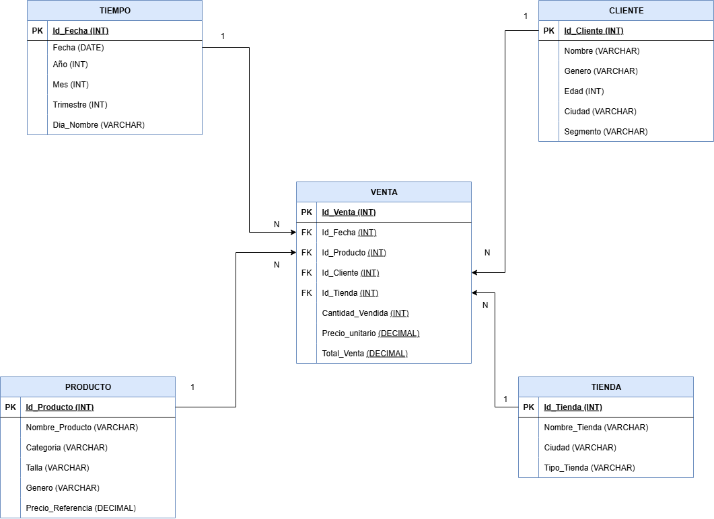

<!DOCTYPE html>
<html lang="es">
<head>
    <meta charset="UTF-8">
    <meta name="viewport" content="width=device-width, initial-scale=1.0">
    <title>Tutorial Interactivo de Normalización de Base de Datos</title>
    <link rel="stylesheet" href="https://stackpath.bootstrapcdn.com/bootstrap/4.5.2/css/bootstrap.min.css">
    
</head>
<body>
    

        <h1 class="text-center mb-4">Tutorial Interactivo de Normalización de Base de Datos</h1>
        
¡Descubre cómo organizar datos como un experto! Esta página, creada por Juan Esteban Catalán Sánchez, te enseña las formas normales (1FN, 2FN, 3FN) con ejemplos divertidos de una tienda de zapatos y cómo implementarlas en MySQL. ¡Explora, aprende y juega con los detalles!

        <!-- Sección MySQL -->
        

            

                

                    <h2 class="mb-0">
                        <button class="btn btn-link btn-block text-left" type="button" data-toggle="collapse" data-target="#collapseCode" aria-expanded="true" aria-controls="collapseCode">
                            <strong>💻 Código en MySQL</strong>
                        </button>
                    </h2>
                

                

                    

                        

                            <!-- Creación -->
                            

                                

                                    <h2 class="mb-0">
                                        <button class="btn btn-link btn-block text-left collapsed" type="button" data-toggle="collapse" data-target="#collapseCreate" aria-expanded="false" aria-controls="collapseCreate">
                                            ⚙️ Creación
                                        </button>
                                    </h2>
                                

                                

                                    

                                        
📌 <strong>Creación (Base de datos y tablas)</strong>

                                        
Cuando hablamos de <strong>crear una base de datos</strong>, nos referimos a diseñar un lugar donde se va a guardar la información de manera organizada.

                                        
Piensa en la base de datos como una <strong>biblioteca 📚</strong>:

                                        <ul>
                                            <li>La base de datos es toda la <strong>biblioteca completa</strong>.</li>
                                            <li>Las tablas son como las <strong>estanterías</strong>, cada una con un tema específico (clientes, productos, ventas, etc.).</li>
                                            <li>Cada columna es como una <strong>categoría</strong> en esa estantería (nombre, edad, precio, cantidad, etc.).</li>
                                            <li>Cada fila es un <strong>registro</strong>, como un libro que guarda la información detallada.</li>
                                        </ul>
                                        
La <strong>creación</strong> es importante porque define la estructura que tendrá tu información. Si no se diseña bien desde el inicio, después puede ser difícil mantener los datos en orden.

                                        

                                            
                                        

                                        

                                            
                                        

                                        

                                            
                                        

                                        

                                            
                                        

                                    

                                

                            

                            <!-- Insertar -->
                            

                                

                                    <h2 class="mb-0">
                                        <button class="btn btn-link btn-block text-left collapsed" type="button" data-toggle="collapse" data-target="#collapseInsert" aria-expanded="false" aria-controls="collapseInsert">
                                            📝 Insertar
                                        </button>
                                    </h2>
                                

                                

                                    

                                        
📌 <strong>Inserción (Agregar datos a la base de datos)</strong>

                                        
Una vez que tienes las estanterías listas (las tablas), necesitas <strong>llenarlas con información</strong>, es decir, insertar los datos.

                                        
Por ejemplo: en la tabla <strong>Clientes</strong>, insertas nombres, teléfonos y direcciones; en <strong>Productos</strong>, guardas precios, cantidades y descripciones.

                                        <h5>👉 ¿Por qué es importante insertar los datos?</h5>
                                        <ul>
                                            <li>Porque la base de datos por sí sola está vacía, como una <strong>estantería sin libros</strong>.</li>
                                            <li>Insertar datos permite analizar la información, hacer consultas y obtener resultados (ejemplo: "¿Cuál es el producto más vendido?" o "¿Quién gastó más dinero?").</li>
                                            <li>También garantiza que la información esté disponible y centralizada, evitando que se pierda o quede regada en documentos sueltos.</li>
                                        </ul>
                                        

                                            
                                        

                                    

                                

                            

                            <!-- Consultas -->
                            

                                

                                    <h2 class="mb-0">
                                        <button class="btn btn-link btn-block text-left collapsed" type="button" data-toggle="collapse" data-target="#collapseConsultas" aria-expanded="false" aria-controls="collapseConsultas">
                                            📊 Consultas
                                        </button>
                                    </h2>
                                

                                

                                    

                                        

                                            <!-- Consultas Simples -->
                                            

                                                

                                                    <h2 class="mb-0">
                                                        <button class="btn btn-link btn-block text-left collapsed" type="button" data-toggle="collapse" data-target="#collapseSimple" aria-expanded="false" aria-controls="collapseSimple">
                                                            🔹 Consultas Simples
                                                        </button>
                                                    </h2>
                                                

                                                

                                                    

                                                        

                                                            
                                                        

                                                        

                                                            
                                                        

                                                        

                                                            
                                                        

                                                    

                                                

                                            

                                            <!-- Consultas Intermedias -->
                                            

                                                

                                                    <h2 class="mb-0">
                                                        <button class="btn btn-link btn-block text-left collapsed" type="button" data-toggle="collapse" data-target="#collapseIntermedia" aria-expanded="false" aria-controls="collapseIntermedia">
                                                            🔹 Consultas Intermedias
                                                        </button>
                                                    </h2>
                                                

                                                

                                                    

                                                        

                                                            
                                                        

                                                        

                                                            
                                                        

                                                    

                                                

                                            

                                            <!-- Consultas Avanzadas -->
                                            

                                                

                                                    <h2 class="mb-0">
                                                        <button class="btn btn-link btn-block text-left collapsed" type="button" data-toggle="collapse" data-target="#collapseAvanzada" aria-expanded="false" aria-controls="collapseAvanzada">
                                                            🔹 Consultas Avanzadas
                                                        </button>
                                                    </h2>
                                                

                                                

                                                    

                                                        

                                                            
                                                        

                                                        

                                                            
                                                        

                                                        

                                                            
                                                        

                                                    

                                                

                                            

                                        

                                    

                                

                            

                            <!-- Extras -->
                            

                                

                                    <h2 class="mb-0">
                                        <button class="btn btn-link btn-block text-left collapsed" type="button" data-toggle="collapse" data-target="#collapseExtras" aria-expanded="false" aria-controls="collapseExtras">
                                            🌟 Extras
                                        </button>
                                    </h2>
                                

                                

                                    

                                        
📌 <strong>Recursos extras para reforzar el aprendizaje</strong>

                                        

                                            
                                        

                                        

                                            
                                        

                                        

                                            
                                        

                                        

                                            
                                        

                                        

                                            
                                        

                                    

                                

                            

                        

                    

                

            

        

        <!-- Sección Normalización -->
        

            <!-- 1FN -->
            

                

                    <h2 class="mb-0">
                        <button class="btn btn-link btn-block text-left" type="button" data-toggle="collapse" data-target="#collapseOne" aria-expanded="true" aria-controls="collapseOne">
                            <strong>Primera Forma Normal (1FN): El Primer Paso para Organizar</strong>
                        </button>
                    </h2>
                

                

                    

                        
Imagina que tienes una lista de compras en una hoja de papel donde todo está escrito en una sola columna larga: nombres de clientes, fechas, productos, precios... todo mezclado. Esto es como una base de datos sin normalizar. La Primera Forma Normal (1FN) es como dividir esa lista en columnas separadas en una tabla, asegurándonos de que cada celda contenga solo un valor simple y único, sin listas o grupos repetidos dentro de una misma celda. Por ejemplo, en lugar de poner "Juan Pérez, 25 años, Bogotá" en una sola celda, lo dividimos en columnas separadas para nombre, edad y ciudad. Esto hace que la información sea "atómica", es decir, indivisible, como átomos en la química.

                        
En nuestra base de datos de ventas de zapatos, empezamos con una tabla grande que incluye todo: detalles de la venta, el cliente, el producto, la tienda y la fecha. Aunque esto parece simple al principio, causa problemas como repetir la misma información muchas veces (por ejemplo, si un cliente compra varios zapatos, su nombre y edad se escriben una y otra vez). Esto no solo ocupa más espacio, sino que puede llevar a errores: ¿qué pasa si actualizas la edad de un cliente en una fila pero olvidas las demás? ¡Inconsistencias por todos lados!

                        <h4><strong>¿Qué se realizó exactamente en la 1FN?</strong></h4>
                        
El objetivo principal fue eliminar cualquier valor multivaluado. Si una celda tenía varios datos separados por comas (como "zapatos, botas, tenis"), lo convertimos en filas separadas o columnas individuales. En este caso, la tabla ya estaba cerca de la 1FN, pero aseguramos que cada columna represente un solo atributo. Sin embargo, todavía hay redundancias porque la información no está separada en temas lógicos. Esto resuelve problemas básicos de almacenamiento, pero deja anomalías: no puedes agregar un cliente nuevo sin una venta, y eliminar una venta podría borrar datos importantes del cliente.

                        

                            
                        

                        
En la imagen arriba, ves cómo se ve la estructura inicial. ¡Pásale el mouse para un efecto sorpresa!

                        <button class="btn btn-primary" data-toggle="collapse" data-target="#details1FN">Explorar Detalles Interactivos y Más Explicaciones</button>
                        

                            <ul>
                                <li><strong>Por qué es importante:</strong> Sin 1FN, buscar información es como buscar tu calcetín perdido en un cajón caótico. ¡Con ella, todo fluye fácil!</li>
                                <li><strong>Anomalía de Inserción:</strong> No puedes agregar un amigo que aún no ha comprado. ¡Es como no invitar a alguien a una fiesta sin un regalo primero!</li>
                                <li><strong>Anomalía de Actualización:</strong> Si tu amigo se muda, debes actualizar su dirección en todas las listas. ¡Olvida una y tendrás un misterio de ciudades!</li>
                                <li><strong>Anomalía de Eliminación:</strong> Borras una compra y ¡boom!, adiós datos del cliente. ¡Es como perder un capítulo de tu serie favorita!</li>
                                <li><strong>Truco divertido:</strong> Imagina que eres un superhéroe organizando datos. ¡La 1FN es tu capa inicial!</li>
                                <li><strong>Desafío para ti:</strong> Prueba dividir una lista desordenada en columnas. ¿Cuántos errores evitas?</li>
                                <li><strong>Extra de diversión:</strong> ¡Gana puntos imaginarios cada vez que entiendas una anomalía!</li>
                            </ul>
                            
¡Sigue explorando y diviértete aprendiendo a ser un maestro de datos!

                        

                    

                

            

            <!-- 2FN -->
            

                

                    <h2 class="mb-0">
                        <button class="btn btn-link btn-block text-left collapsed" type="button" data-toggle="collapse" data-target="#collapseTwo" aria-expanded="false" aria-controls="collapseTwo">
                            <strong>Segunda Forma Normal (2FN): Eliminando Repeticiones Parciales</strong>
                        </button>
                    </h2>
                

                

                    

                        
Ahora que tenemos nuestra tabla organizada en columnas simples (gracias a la 1FN), notamos que hay repeticiones. Por ejemplo, si el mismo zapato se vende muchas veces, su precio y descripción se repiten en cada fila. La Segunda Forma Normal (2FN) resuelve esto separando la información en tablas más pequeñas y especializadas. Cada tabla se enfoca en un tema: una para clientes, otra para productos, otra para fechas, etc. Usamos "claves" (como números ID únicos) para conectarlas, como hilos que unen piezas de un rompecabezas.

                        
En términos simples, 2FN asegura que cada pieza de información dependa completamente de la "clave principal" de su tabla. Si algo depende solo de parte de la clave (en tablas con claves compuestas), lo movemos a una nueva tabla. En nuestra tienda de zapatos, creamos tablas separadas para "Tiempo" (fechas), "Cliente", "Producto", "Tienda" y "Venta" (que une todo). Así, el nombre de un cliente se guarda solo una vez, y en la tabla de ventas solo ponemos su ID. Esto reduce el espacio y evita errores al actualizar datos.

                        <h4><strong>¿Qué se realizó exactamente en la 2FN?</strong></h4>
                        
Identificamos "dependencias parciales": por ejemplo, la edad de un cliente depende solo del cliente, no de la venta específica. Así que movimos esos detalles a su propia tabla. Ahora, si un producto cambia de precio, lo actualizas en un solo lugar. Esto hace la base más eficiente, como organizar tus fotos en álbumes temáticos en lugar de mezclar todo en una caja grande. Sin embargo, aún hay dependencias "transitivas" (como un campo que depende de otro campo no clave), que resolveremos en la siguiente forma.

                        
<strong>Estructura en 2FN (Esquema con Tablas Separadas):</strong> Aquí mostramos los campos de cada tabla para que veas cómo se divide la info.

                        
<strong>Tabla TIEMPO:</strong>

                        <table class="table table-bordered table-striped">
                            <thead><tr><th>Campo</th><th>Tipo</th></tr></thead>
                            <tbody>
                                <tr><td>Id_Fecha</td><td>INT (PK)</td></tr>
                                <tr><td>Fecha</td><td>DATE</td></tr>
                                <tr><td>Año</td><td>INT</td></tr>
                                <tr><td>Mes</td><td>INT</td></tr>
                                <tr><td>Trimestre</td><td>INT</td></tr>
                                <tr><td>Dia_Nombre</td><td>VARCHAR</td></tr>
                            </tbody>
                        </table>
                        
<strong>Tabla CLIENTE:</strong>

                        <table class="table table-bordered table-striped">
                            <thead><tr><th>Campo</th><th>Tipo</th></tr></thead>
                            <tbody>
                                <tr><td>Id_Cliente</td><td>INT (PK)</td></tr>
                                <tr><td>Nombre</td><td>VARCHAR</td></tr>
                                <tr><td>Genero</td><td>VARCHAR</td></tr>
                                <tr><td>Edad</td><td>INT</td></tr>
                                <tr><td>Ciudad</td><td>VARCHAR</td></tr>
                                <tr><td>Segmento</td><td>VARCHAR</td></tr>
                            </tbody>
                        </table>
                        
<strong>Tabla PRODUCTO:</strong>

                        <table class="table table-bordered table-striped">
                            <thead><tr><th>Campo</th><th>Tipo</th></tr></thead>
                            <tbody>
                                <tr><td>Id_Producto</td><td>INT (PK)</td></tr>
                                <tr><td>Nombre_Producto</td><td>VARCHAR</td></tr>
                                <tr><td>Categoria</td><td>VARCHAR</td></tr>
                                <tr><td>Talla</td><td>VARCHAR</td></tr>
                                <tr><td>Genero</td><td>VARCHAR</td></tr>
                                <tr><td>Precio_Referencia</td><td>DECIMAL</td></tr>
                            </tbody>
                        </table>
                        
<strong>Tabla TIENDA:</strong>

                        <table class="table table-bordered table-striped">
                            <thead><tr><th>Campo</th><th>Tipo</th></tr></thead>
                            <tbody>
                                <tr><td>Id_Tienda</td><td>INT (PK)</td></tr>
                                <tr><td>Nombre_Tienda</td><td>VARCHAR</td></tr>
                                <tr><td>Ciudad</td><td>VARCHAR</td></tr>
                                <tr><td>Tipo_Tienda</td><td>VARCHAR</td></tr>
                            </tbody>
                        </table>
                        
<strong>Tabla VENTA:</strong>

                        <table class="table table-bordered table-striped">
                            <thead><tr><th>Campo</th><th>Tipo</th></tr></thead>
                            <tbody>
                                <tr><td>Id_Venta</td><td>INT (PK)</td></tr>
                                <tr><td>Id_Fecha</td><td>INT (FK)</td></tr>
                                <tr><td>Id_Producto</td><td>INT (FK)</td></tr>
                                <tr><td>Id_Cliente</td><td>INT (FK)</td></tr>
                                <tr><td>Id_Tienda</td><td>INT (FK)</td></tr>
                                <tr><td>Cantidad_Vendida</td><td>INT</td></tr>
                                <tr><td>Precio_unitario</td><td>DECIMAL</td></tr>
                                <tr><td>Total_Venta</td><td>DECIMAL</td></tr>
                            </tbody>
                        </table>
                        

                            
                        

                        
La imagen muestra cómo las tablas se conectan con flechas, representando relaciones. ¡Pásale el mouse para un efecto mágico!

                        <button class="btn btn-primary" data-toggle="collapse" data-target="#details2FN">Explorar Detalles Interactivos y Más Explicaciones</button>
                        

                            <ul>
                                <li><strong>Dependencias Parciales Eliminadas:</strong> Si un precio depende solo del producto, ¡lo movemos a su casa (tabla)! Todo debe depender de la clave principal.</li>
                                <li><strong>Beneficios en la vida real:</strong> Más espacio libre y consultas rápidas. ¡Es como tener un armario organizado para encontrar tus zapatitos!</li>
                                <li><strong>Interactividad en bases de datos:</strong> Usa "JOIN" como un hechizo para unir tablas y ver todo como un mapa del tesoro.</li>
                                <li><strong>Problemas pendientes:</strong> "Trimestre" depende de "Mes", ¡es un pequeño misterio que resolveremos después!</li>
                                <li><strong>Truco divertido:</strong> Imagina que eres un chef separando ingredientes. ¡Cada tabla es una receta diferente!</li>
                                <li><strong>Desafío para ti:</strong> Intenta conectar dos tablas con un ID. ¡Siente el poder de la organización!</li>
                                <li><strong>Extra de diversión:</strong> ¡Gana una medalla virtual por cada tabla que entiendas!</li>
                            </ul>
                            
¡Sigue jugando y conviértete en un ninja de las bases de datos!

                        

                    

                

            

            <!-- 3FN -->
            

                

                    <h2 class="mb-0">
                        <button class="btn btn-link btn-block text-left collapsed" type="button" data-toggle="collapse" data-target="#collapseThree" aria-expanded="false" aria-controls="collapseThree">
                            <strong>Tercera Forma Normal (3FN): Limpiando Dependencias Escondidas</strong>
                        </button>
                    </h2>
                

                

                    

                        
Con las tablas separadas en 2FN, todo parece mejor, pero aún hay "dependencias ocultas". Por ejemplo, en la tabla de Tiempo, el "Trimestre" se calcula directamente del "Mes" (enero-marzo es trimestre 1), no de la clave principal. Esto es una dependencia transitiva: A depende de B, y B depende de C, así que A depende indirectamente de C. La Tercera Forma Normal (3FN) elimina estas dependencias moviendo campos derivados a tablas nuevas o eliminándolos si se pueden calcular en el momento.

                        
En simple: 3FN asegura que cada campo en una tabla dependa solo de la clave principal, no de otros campos no clave. Esto hace la base aún más limpia y evita anomalías. En nuestra base de ventas, revisamos cada tabla y removemos campos como "Trimestre" o "Día de la Semana", porque se pueden obtener automáticamente de la fecha usando fórmulas. Así, la base es más ligera y consistente: si cambias un mes, no tienes to preocuparte por actualizar el trimestre manualmente.

                        <h4><strong>¿Qué se realizó exactamente en la 3FN?</strong></h4>
                        
Analizamos dependencias transitivas y las resolvimos. Por ejemplo, en la tabla TIEMPO, eliminamos "Trimestre" (calculable como (Mes-1)/3 +1) y "Dia_Nombre" (obtenible con funciones de fecha). Campos como "Total_Venta" en VENTA podrían calcularse (Cantidad * Precio), pero a veces se mantienen por velocidad en sistemas grandes. Esto optimiza el almacenamiento y previene errores, como tener un mes de febrero en trimestre 2 por un descuido.

                        
<strong>Estructura en 3FN (Esquema Optimizado):</strong> Nota cómo algunas tablas se simplifican.

                        
<strong>Tabla TIEMPO (Modificada para eliminar transitivas):</strong>

                        <table class="table table-bordered table-striped">
                            <thead><tr><th>Campo</th><th>Tipo</th></tr></thead>
                            <tbody>
                                <tr><td>Id_Fecha</td><td>INT (PK)</td></tr>
                                <tr><td>Fecha</td><td>DATE</td></tr>
                                <tr><td>Año</td><td>INT</td></tr>
                                <tr><td>Mes</td><td>INT</td></tr>
                            </tbody>
                        </table>
                        
Las otras tablas (CLIENTE, PRODUCTO, TIENDA, VENTA) se mantienen similares a 2FN, ya que no tenían más transitivas evidentes.

                        

                            
                        

                        
La imagen ilustra la estructura final, más limpia y conectada. ¡Pásale el mouse para un toque mágico!

                        <button class="btn btn-primary" data-toggle="collapse" data-target="#details3FN">Explorar Detalles Interactivos y Más Explicaciones</button>
                        

                            <ul>
                                <li><strong>Dependencias Transitivas Eliminadas:</strong> Quitamos los "atajos" como "Trimestre" para que todo dependa de la clave principal. ¡Sin trampas!</li>
                                <li><strong>Beneficios en la vida real:</strong> Menos errores y más espacio. ¡Es como limpiar tu mochila para un viaje épico!</li>
                                <li><strong>Interactividad en consultas:</strong> Usa QUARTER(Fecha) como un hechizo para calcular trimestres al instante.</li>
                                <li><strong>Notas finales para principiantes:</strong> 3FN es tu escudo dorado; hay niveles más altos, pero ¡ya eres un héroe de datos!</li>
                                <li><strong>Truco divertido:</strong> Imagina que eres un detective eliminando pistas falsas. ¡Solo queda la verdad!</li>
                                <li><strong>Desafío para ti:</strong> Calcula un trimestre con una fecha. ¡Eres el mago de los números!</li>
                                <li><strong>Extra de diversión:</strong> ¡Gana un trofeo virtual por dominar la 3FN!</li>
                            </ul>
                            
¡Sigue la aventura y sé el rey de la organización de datos!

                        

                    

                

            

        

    

    
    
    
</body>
</html>
